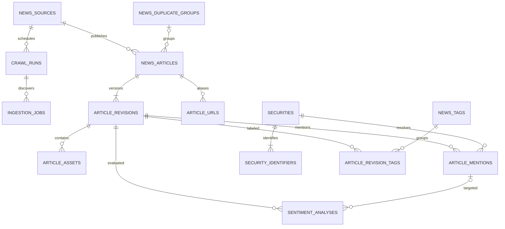

# Thiết kế database và backup tin tức

Tài liệu thuộc [kế hoạch tin tức](vietnam-stock-news.md). Đây là schema logic để chuyển thành
migration khi triển khai, chưa phải migration đã chạy. **Một PostgreSQL chính; chỉ backup
định kỳ, không replica**, theo xác nhận của người dùng ngày 29/09/2026.

## 1. Quy ước và nguồn dữ liệu chuẩn

- PK dùng UUID tạo tại ứng dụng. Timestamp dùng `timestamptz`, ghi UTC; UI hiển thị
  `Asia/Ho_Chi_Minh`. Không dùng timestamp không timezone cho thời điểm thực tế.
- Các bảng có PK `id` trừ bảng nối nêu rõ composite PK. Trường không ghi nullable là bắt buộc;
  collection rỗng là `[]`, không dùng chuỗi rỗng thay null.
- Trường `created_at` có ở mọi bảng; `updated_at` có ở bảng mutable. Mọi FK đều được chỉ rõ
  hành vi xóa ở mục 4. Enum mô tả bên dưới được enforce bằng CHECK có migration version.
- `news_articles` quản lý identity/trạng thái; `article_revisions` là nguồn chuẩn của nội dung.
  API lấy title/body từ revision hiện tại, tránh hai bản nội dung mutable cần đồng bộ.
- Không lưu file ảnh/video lớn trực tiếp trong DB. DB chứa URL, caption, checksum, quyền sử dụng
  và storage key nếu có tải file. Chỉ tải media được phép; thiếu quyền thì giữ metadata/link.
- Trường tài chính trích xuất tùy chọn có `raw_text`, `value_decimal` dạng chuỗi decimal,
  `unit`, `currency`, `as_of`, `block_id`; không biến mọi số trong bài thành giá realtime.

## 2. Quan hệ chính

`current_revision_id` phải trỏ revision thuộc chính bài; không chỉ FK tới một revision bất kỳ.

## 3. Bảng và trường

### 3.1 `news_sources`

| Trường | Kiểu | Ý nghĩa / ràng buộc |
| --- | --- | --- |
| `id`, `slug`, `name`, `base_url` | uuid, varchar(64), text, text | `slug` unique, tên và URL chuẩn |
| `status` | varchar(24) | pending_review / active / paused / blocked |
| `adapter_key`, `parser_version`, `timezone` | text | Adapter trong allowlist code, timezone IANA |
| `allowed_domains`, `discovery_urls` | jsonb arrays | Schema và độ dài kiểm tra ở boundary; không cho nhập code tùy ý |
| `crawl_interval_seconds`, `request_interval_ms`, `max_concurrency` | integer | CHECK >0, lịch ngoài giờ trong config có schema |
| `access_policy` | jsonb | robots URL/check time, terms URL, evidence tham chiếu, media/attachment policy |
| `storage_mode`, `display_mode` | varchar(24) | full_text / metadata_only / link_only; display không được rộng hơn storage |
| `policy_checked_at`, `last_success_at` | timestamptz nullable | Không biết thì null |
| `blocked_reason` | text nullable | Lý do vận hành an toàn, không chứa credential |
| `row_version` | bigint | Tăng khi đổi cấu hình, dùng optimistic concurrency cho PATCH |

### 3.2 `news_articles` và `article_urls`

| Bảng | Trường | Ràng buộc / mục đích |
| --- | --- | --- |
| articles | `id`, `source_id`, `source_article_id` (text nullable) | Unique partial `(source_id, source_article_id)` khi ID không null |
| articles | `canonical_url` text, `canonical_url_hash` char(64) | Unique `(source_id, canonical_url_hash)`; hash SHA-256 của URL chuẩn; kiểm tra URL thật khi hash trùng |
| articles | `slug` text | Để hiển thị/SEO, không làm identity hoặc yêu cầu unique |
| articles | `current_revision_id` uuid nullable, `row_version` bigint | CAS tăng version, current revision chỉ nullable trước publish trong transaction |
| articles | `visibility` varchar(20), `enrichment_status` varchar(20) | visibility: draft/published/quarantined/withdrawn; enrichment: pending/ready/failed/stale |
| articles | `first_seen_at`, `last_seen_at`, `feed_at` timestamptz | feed_at = thời gian nguồn đăng lần đầu xác định được, fallback first_seen; đóng băng khi publish |
| articles | `duplicate_group_id` uuid nullable | FK nhóm bài trùng, không xóa identity riêng |
| articles | `withdrawn_at` timestamptz nullable, `withdrawal_reason` text nullable | Takedown khác với URL nguồn tạm lỗi |
| urls | `id`, `article_id`, `source_id`, `url` text, `url_hash` char(64), `kind` | Unique `(source_id,url_hash)`; kind original/canonical/redirect; composite FK bảo đảm cùng source với article |

CHECK `visibility != 'published' OR current_revision_id IS NOT NULL`. Canonical đổi nhưng ID
nguồn/alias đã biết thì cập nhật identity hiện có; xung đột hai identity đưa vào review transaction.
API public `updated_at` lấy thời gian **nguồn sửa bài**, không phải `news_articles.updated_at`.

### 3.3 `article_revisions`

| Nhóm | Trường và kiểu |
| --- | --- |
| Identity | `id`, `article_id` uuid; `revision_no` integer >0; unique `(article_id,revision_no)` và `(article_id,id)` |
| Nội dung | `title` text not blank; `description` text nullable; `content_text` text nullable; `content_blocks` jsonb array; `language` varchar(12) mặc định vi |
| Người viết | `authors` jsonb array các object `{name, profile_url?}`; không tự tạo tác giả khi nguồn không có |
| Phân loại | `category_raw` text nullable; `category_key` text nullable theo taxonomy sản phẩm |
| Thời gian nguồn | `published_at`, `source_updated_at` timestamptz nullable; `date_raw` jsonb; `date_precision` exact/date_only/unknown |
| Truy xuất | `fetched_at` timestamptz; `parser_version` text; `http_status` smallint; `content_hash`, `revision_hash` char(64); `etag`, `last_modified` text nullable |
| Chất lượng | `extraction_status` complete/partial/metadata_only; `quality_flags` jsonb array; `field_provenance` jsonb map đường metadata/selector và phương thức trích |
| Mở rộng | `source_metadata` jsonb object có whitelist; `entities` jsonb array cho chỉ số/ngành/tổ chức/số liệu được trích |
| Snapshot | `raw_snapshot_key` text nullable; `raw_snapshot_sha256` char(64) nullable; chỉ lưu khi policy cho phép |
| Tìm kiếm | `search_text_normalized` text; `search_vector` tsvector được build cùng transaction |

`content_blocks` có schema version, danh sách block có ID ổn định trong revision và type:
paragraph, heading, list, quote, table, image, video, audio, attachment. Text/link được kiểm tra
schema; block media trỏ `asset_id`. Ưu tiên render block bằng component thay vì raw HTML;
nếu cần HTML thì có trường `content_html_sanitized` nullable với sanitizer version riêng.

`content_hash` chỉ dùng nhận diện nội dung giống nhau; `revision_hash` gồm cả metadata có ý
nghĩa. So sánh với revision **hiện tại** trước insert. Không unique `(article_id,content_hash)`:
bài thay đổi A→B→A vẫn phải có revision thứ ba. Fetch lặp cùng job được ngăn bởi job identity
và khóa/CAS của article. Bản parse lỗi không thay thế revision đang public hợp lệ.

### 3.4 `article_assets`, `news_tags`, `article_revision_tags`

- `article_assets`: `id`, `revision_id`, `kind` (image/video/audio/document), `role`
  (thumbnail/inline/attachment), `position` integer >=0, `original_url`, `resolved_url` nullable,
  `alt`, `caption`, `credit`, `mime_type`, `width`, `height`, `byte_size`, `sha256`, `storage_key`
  đều nullable khi nguồn không cung cấp; `download_status` link_only/pending/ready/failed/blocked;
  `extracted_text` nullable cho file được phép parse, `extraction_status` pending/ready/unsupported/failed.
- Unique `(revision_id,kind,position)`; width/height/byte_size >0 khi có; chỉ một thumbnail/revision
  bằng partial unique index. Video/audio mặc định chỉ metadata/link, không tải binary.
- `news_tags`: `id`, `slug` unique, `label`; `article_revision_tags` composite PK
  `(revision_id,tag_id)`. Tag nguồn nguyên văn nằm trong `source_metadata` nếu khác nhãn chuẩn.

### 3.5 Security master và đề cập mã

- `securities`: `id`, `issuer_name`, `instrument_type`, `isin` nullable, `is_active`,
  `master_source`, `master_verified_at`. Không dùng symbol làm PK.
- `security_identifiers`: `id`, `security_id`, `symbol`, `exchange` (HOSE/HNX/UPCOM),
  `valid_from` date, `valid_to` date nullable. CHECK valid_to > valid_from; thời hạn `[from,to)`.
  Ngăn khoảng thời gian chồng lặp cho cùng `(exchange,symbol)` bằng exclusion constraint
  (migration khai báo `btree_gist`) để tránh hai security đồng thời dùng cùng mã.
- `security_aliases`: `id`, `security_id`, `alias`, `normalized_alias`, `valid_from`, `valid_to`
  nullable; alias không unique toàn cục vì tên có thể mơ hồ.
- `article_mentions`: `id`, `revision_id`, `security_id`, `identifier_id`, `is_primary` boolean,
  `method` source_tag/exchange_pattern/company_alias/manual, `resolver_version`,
  `confidence` numeric(5,4) nullable CHECK [0,1], `evidence` jsonb array `{block_id,start,end,quote}`.
  Offset theo Unicode code point trong `content_text` của revision được nêu; quote phải khớp.
  Unique `(revision_id,security_id)`; nhiều bằng chứng gộp array có giới hạn.
- FK composite `(security_id,identifier_id)` bảo đảm identifier thuộc security. Identity dùng
  thời điểm xuất bản nếu biết; fallback thời điểm first_seen với quality flag, không giấu suy luận.
- `unresolved_symbols` nằm trong `article_revisions.source_metadata`, không đưa vào bộ lọc mã
  xác minh. Chuyển candidate thành mention phải version resolver và audit.

### 3.6 `sentiment_analyses`

| Trường | Kiểu / quy tắc |
| --- | --- |
| `id`, `revision_id`, `mention_id` nullable | mention null = toàn bài; FK composite bảo đảm mention thuộc revision |
| `method`, `analyzer_version`, `input_hash` | rules/model/manual và phiên bản bất biến; hash gồm revision + target + resolver context |
| `status` | pending/ready/failed; stale được API suy khi revision không còn hiện tại |
| `label` nullable | positive/negative/neutral/mixed/unknown; pending/failed thì null |
| `score` numeric(6,5) nullable | [-1,1]; unknown thì null |
| `confidence` numeric(5,4) nullable | [0,1]; null khi không có phép hiệu chuẩn/đánh giá hợp lệ |
| `rationale` text nullable, `evidence` jsonb array | Diễn giải ngắn, evidence tham chiếu revision, không lưu chain-of-thought |
| `analyzed_at` timestamptz nullable, `horizon` text nullable | Phân tích sắc thái văn bản dùng horizon null |
| `is_current` boolean | Chỉ kết quả ready có thể current; chuyển current trong transaction |
| `error_code` text nullable | Lỗi an toàn, không chứa prompt/secret |

Unique `(revision_id,mention_id,analyzer_version,input_hash) NULLS NOT DISTINCT` cho idempotency.
Unique partial `(revision_id,mention_id) NULLS NOT DISTINCT WHERE is_current` cho kết quả đang
dùng. CHECK `(status='ready') = (label IS NOT NULL)` và current chỉ khi ready.
Ngữ nghĩa `unknown` không dùng score=0; `neutral` là kết quả có bằng chứng trung tính.
Kết quả retry cùng input cập nhật attempt hiện tại; khi đổi model/input tạo hàng mới.
Thêm UNIQUE `(security_id,id)` trên identifiers và `(revision_id,id)` trên mentions để làm
đích composite FK. CHECK unknown bắt buộc score null; ready với nhãn khác unknown có score.

### 3.7 Công việc, audit và nhóm trùng

- `crawl_runs`: `id`, `source_id`, `trigger` scheduled/manual/backfill, `status`,
  `started_at`, `finished_at` nullable, `checkpoint` jsonb, các bộ đếm discovered/created/
  updated/unchanged/failed, `request_id`; thời gian bắt đầu/kết thúc là UTC.
- `ingestion_jobs`: `id`, `source_id`, `crawl_run_id` nullable, `article_id` nullable,
  `revision_id` nullable, `job_type` discover/fetch/resolve/analyze, `payload_version`,
  `payload` jsonb bounded, `job_key` text unique, `status` pending/dispatched/running/succeeded/
  failed/cancelled, `attempt_count`, `max_attempts`, `next_attempt_at`, `lease_until` nullable,
  `fencing_token` bigint, `error_code` nullable. CHECK attempts >=0 và <= max_attempts.
- Fetch key dùng source + URL hash + discovery/recheck window; không dùng URL vĩnh viễn
  làm job key vì cần recrawl. Analyze key dùng revision + target + analyzer/input version.
  Dispatcher query pending/due/expired lease, claim bằng `FOR UPDATE SKIP LOCKED`, commit,
  rồi publish job ID. Publish lỗi giữ job để retry; publish thành công mà process chết cũng
  không gây ghi trùng. Worker phải kiểm tra token/version trước commit.
- `news_duplicate_groups`: `id`, `method`, `fingerprint`, `representative_article_id` nullable.
  Representative không được xóa các bản từ nguồn khác và không tạo yêu cầu phải cùng timestamp.
- `news_admin_audit`: `id`, `actor_id` text, `action`, `target_type`, `target_id` uuid,
  `reason`, `before_summary`/`after_summary` jsonb allowlist, `request_id`, `created_at`.
  Actor lấy từ auth đã xác minh. Giữ ID tham chiếu an toàn khi tài khoản bị xóa theo privacy policy.
- `news_idempotency_keys`: `id`, `actor_id` text, `operation` text, `key_hash` char(64),
  `request_hash` char(64), `operation_id` uuid, `response_status` smallint,
  `response_body` jsonb bounded, `expires_at` timestamptz. Unique `(actor_id,operation,key_hash)`;
  giữ 24 giờ, ghi cùng transaction tạo crawl-run/job. Operation ID là reference có loại,
  validate tại application boundary, không FK đa hình. Không lưu secret/token trong response.

## 4. FK, transaction và tìm kiếm

- Source→article/run/job: RESTRICT; ngưng nguồn bằng status, không hard-delete khi còn dữ liệu.
- Article→revision/URL: CASCADE khi hard purge có chủ đích. Article→job: SET NULL để giữ audit.
  Article→current revision: composite `(id,current_revision_id)` → `(article_id,id)`, deferred
  NO ACTION; khi purge phải clear current pointer trước. Revision→asset/mention/tag/analysis:
  CASCADE. Revision→job: SET NULL. Run→job: SET NULL.
- Security→identifier/alias/mention và identifier→mention: RESTRICT; tắt mã thay vì xóa lịch sử.
  Mention→analysis: CASCADE với FK composite revision/mention. Tag→junction: CASCADE.
  Duplicate group→article và representative article→group: SET NULL. Audit không cascade theo target.
  Composite FK URL→article cần UNIQUE `(source_id,id)` trên articles; FK composite có cột
  chung không dùng SET NULL toàn bộ khi cột chung bắt buộc, chọn CASCADE/NO ACTION như trên.
- Transaction ingest: khóa/CAS article → insert revision/assets/tags → set current pointer →
  mark enrichment pending → insert durable jobs → commit. Resolve và analyze commit riêng,
  kiểm tra revision vẫn hiện tại trước cập nhật trạng thái public. Không chứa network call.
- Chỉ mục B-tree partial cho published `(feed_at DESC,id DESC)`, `(source_id,feed_at DESC,id DESC)`;
  revision `(article_id,revision_no DESC)`, `(category_key,published_at DESC)`; mention
  `(security_id,revision_id)`; partial analysis `(label,revision_id)` khi current/ready;
  job `(status,next_attempt_at)` và expired lease. Index FK theo query thực tế.
- Search MVP dùng PostgreSQL FTS `simple` với text bỏ dấu được chuẩn hóa khi ingest/query,
  GIN cho search_vector; title/mã/tên ưu tiên hơn body. Đây là tìm kiếm token cơ bản,
  không hứa hiểu ngữ nghĩa tiếng Việt. Phải thử nghiệm câu có/không dấu và tên viết tắt.
- Feed sắp xếp `(feed_at DESC,id DESC)` bất biến, cursor giữ snapshot time + bộ lọc + key cuối.
  Chỉ lấy bài first_seen <= snapshot. Không giữ transaction snapshot giữa HTTP request;
  khi filter mutable thay đổi có thể phải refresh feed, không hứa snapshot toàn phần.
- List chỉ select summary projection; detail mới load blocks/media; batch mentions/sentiment
  và không N+1. `EXPLAIN (ANALYZE, BUFFERS)` trên dữ liệu đại diện trước khi thêm index/cache.

## 5. Retention và xóa

- Bài/revision chuẩn hóa: giữ lâu dài cho lịch sử tin khi policy cho phép; theo dõi dung lượng,
  duyệt lại mỗi quý. Raw snapshot: 30 ngày; crawl run/job hoàn tất: 90 ngày; audit admin: 365 ngày.
- Asset immutable còn revision tham chiếu thì giữ theo source policy; asset mồ côi chỉ purge
  sau khi không còn trong manifest backup được giữ. Snapshot hết hạn có thể để key thiếu
  với trạng thái expired; không ảnh hưởng nội dung bài đã chuẩn hóa.
- Takedown ẩn ngay khỏi API/search, purge nội dung theo policy; giữ tombstone ID/hash/reason
  tối thiểu để tránh crawler đưa bài trở lại. Danh sách purge có bản độc lập dùng khi restore.
- Backup tuân retention; restore phải áp dụng lại tombstone/xóa sau snapshot trước khi mở API.
  Không đưa dump/raw HTML thật, personal data hay artifact model vào Git hoặc fixture CI.
  Retention raw 30 ngày áp dụng kho đang chạy; bản trong backup tồn tại tới hạn backup tối đa
  12 tuần. Nếu source policy yêu cầu xóa sớm hơn, loại raw khỏi backup dài hạn hoặc rút retention
  tương ứng và ghi rõ trong profile nguồn; không mặc định kéo dài quyền lưu qua backup.

## 6. Backup định kỳ

### Phương án tối giản

Dùng logical backup `pg_dump` custom format (`-Fc`) cho toàn application database để các
bảng liên quan nằm cùng snapshot; restore bằng `pg_restore`. Dump không chứa cluster roles,
nên cần manifest role/extension và quy trình tạo quyền từ secret store. Đây là đặc tính của
[SQL dump PostgreSQL 17](https://www.postgresql.org/docs/17/backup-dump.html).

| Hạng mục | Thiết kế đề xuất |
| --- | --- |
| Lịch | Mỗi 6 giờ: 00:00, 06:00, 12:00, 18:00 UTC; tương ứng 07:00, 13:00, 19:00, 01:00 giờ Việt Nam |
| Scheduler | Timer/cron riêng, một scheduler và lock chống trùng; không phụ thuộc Redis/Celery |
| Đích | Kho object storage hoặc máy backup độc lập, khác ổ/host DB, private và mã hóa; provider cấu hình sau |
| Retention | Bản 6 giờ giữ 7 ngày; một bản/ngày giữ 30 ngày; một bản/tuần giữ 12 tuần; hợp của các nhãn, không cần copy trùng |
| Mục tiêu RPO | Tối đa 6 giờ + thời gian hoàn tất backup khi lịch khỏe; không bảo đảm nếu job thất bại. Cảnh báo bản hợp lệ cuối >7 giờ |
| Mục tiêu RTO | <=2 giờ với dataset MVP; chỉ xác nhận sau restore drill đo được |
| Backup bổ sung | Trước migration thay đổi dữ liệu; backup cũ không bị xóa chỉ vì backup mới khởi chạy |
| Quyền | Role đọc đủ bảng, không cấp quyền ghi không cần thiết; credential lấy từ secret store, không log hoặc truyền URL có password vào lệnh minh họa |

Lịch/retention là cấu hình khởi điểm, có thể điều chỉnh theo dung lượng và yêu cầu mất dữ liệu.
Không có automatic failover hay phục hồi tới từng thời điểm giữa hai dump trong phạm vi này.

### Job backup

1. Kiểm tra đích lưu, dung lượng, phiên bản PostgreSQL client 17 tương thích, khóa chống chạy
   chồng và kết nối role backup. Job có timeout 60 phút ban đầu; quá hạn báo thất bại.
2. Tạo dump vào file tạm riêng; kiểm tra exit code, dung lượng, danh mục archive. Tùy chọn
   format/quyền/tham số được đối chiếu với [tài liệu pg_dump](https://www.postgresql.org/docs/17/app-pgdump.html).
3. Tạo manifest: backup ID, snapshot/start/end UTC, PostgreSQL/schema version, checksum
   SHA-256, số byte, danh sách extension/role cần tạo và tập asset cần khôi phục.
4. Đối với raw/media lưu ngoài DB: dùng key immutable, upload object hoàn tất trước DB commit,
   backup/copy tất cả object được snapshot tham chiếu, giữ object cũ tới khi backup hết retention.
   Có thể lấy danh sách từ restore staging của dump hoặc cùng exported snapshot; không dùng
   query DB chạy sau dump để giả định cùng snapshot. URL nguồn ngoài hệ thống chỉ lưu link,
   không tuyên bố backup được binary chưa tải.
5. Upload encrypted dump/manifest/assets; kiểm checksum bằng tải/đọc lại hoặc checksum API
   có kiểm chứng, không giả định ETag luôn là MD5. Ghi dấu `complete` sau tất cả thành công.
6. Chỉ prune bản hết retention khi có backup complete hợp lệ; giữ bản good cuối và cảnh báo
   nếu backup mới lỗi. Ghi backup status ngoài DB chính để còn xem khi DB chính hỏng.

### Khôi phục và kiểm chứng

1. Chọn backup complete, xác minh manifest/checksum/key mã hóa. Tạo DB trống cách ly và
   khôi phục roles/extensions cần thiết; không restore thẳng đè DB đang chạy.
2. Dùng `pg_restore` với dừng khi lỗi, kiểm toàn bộ exit status và quyền sở hữu/ACL;
   chỉ `--no-owner/--no-acl` khi sẽ tái cấp quyền theo manifest. Xem
   [tài liệu pg_restore](https://www.postgresql.org/docs/17/app-pgrestore.html).
3. Xác nhận migration version, row counts, FK, current revision, mã/sentiment và tiếng Việt;
   khôi phục asset rồi kiểm hash. Chạy `ANALYZE` và smoke list/detail API trên DB phục hồi.
4. Áp dụng tombstone/xóa phát sinh sau snapshot; không khôi phục credential đã thu hồi.
   Reset lease/job trạng thái dở dang có kiểm soát; dùng Redis namespace sạch, xóa cache cũ,
   kiểm idempotency trước khi mở ingestion để job cũ không ghi bừa vào DB đã khôi phục.
5. Khi cần cutover thực tế, dừng ghi vào DB lỗi, giữ bản phục vụ điều tra, đổi kết nối sau
   kiểm chứng và ghi nhận RPO/RTO thực tế. Plan này không thực hiện cutover/deploy.

Mỗi backup kiểm cấu trúc/checksum; mỗi tuần tự động restore vào DB test cách ly, mỗi tháng
diễn tập toàn luồng gồm asset và API. Restore đầu tiên thành công là điều kiện nghiệm thu
backup, không chỉ dựa vào thông báo “upload thành công”.
