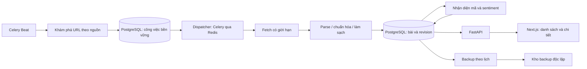

# Kế hoạch: Tin tức thị trường chứng khoán Việt Nam

- Ngày: 29/09/2026.
- Trạng thái: MVP hai nguồn đã triển khai; xem [báo cáo thực thi](news-implementation-report.md).
- Stack hiện tại: FastAPI, Next.js/TypeScript, PostgreSQL 17, Celery/Redis, Nginx.
- Tài liệu liên quan: [database](news-database.md), [API và UI](news-api-ui.md).
- Chốt theo phản hồi của người dùng: **backup định kỳ; không có database replica**.

## 1. Kết quả người dùng cần

1. Tập hợp tin thị trường Việt Nam, doanh nghiệp niêm yết, vĩ mô và công bố thông tin
   từ các nguồn trong ảnh tham chiếu.
2. Lưu đầy đủ thông tin bài có thể thu thập: URL, tiêu đề, mô tả, nội dung, tác giả,
   ngày đăng/cập nhật, chuyên mục, tag, thumbnail, ảnh, nguồn; bổ sung bảng, tài liệu,
   mã chứng khoán, bằng chứng nhận diện và đánh giá tích cực/tiêu cực.
3. Có trang danh sách dễ lọc/tìm và trang chi tiết dễ đọc, hiển thị nguồn cùng thời điểm dữ liệu.
4. Header theo bố cục ảnh 3 nhưng **nền trắng, chữ đen**; logo InvestIQ theo ảnh 4.
5. Dữ liệu có backup định kỳ và quy trình khôi phục kiểm chứng được.
6. API có cấu hình môi trường, version và ranh giới rõ ràng để thuận tiện deploy sau này.

“Đầy đủ” nghĩa là lấy các trường xuất hiện và được phép sử dụng trong bài, không tự bịa
trường còn thiếu. Không thu toàn bộ website, tài khoản, bình luận cá nhân, dữ liệu bảng giá
hay dữ liệu trả phí vào phạm vi tin tức. Giá/chỉ số được trích trong bài là thông tin tại thời
điểm bài viết, không phải giá realtime của InvestIQ.

## 2. Hiện trạng và các giả định

- Repo đã có service chạy được, Celery worker/Beat và Redis; Beat chưa có lịch crawl.
- `api/v1/news.py`, entity/model/repository tin tức, crawler CafeF/Vietstock/FireAnt,
  use case ingestion/sentiment và `user-header.tsx` mới là placeholder.
- Chưa có route trang `/news`; chưa có logo riêng trong `frontend/public/`.
- Ảnh 4 hiện trùng ảnh header, logo trong ảnh rất nhỏ: khi làm UI cần asset logo gốc
  hoặc dựng wordmark tạm có ghi nhận. Không coi ảnh chụp cả header là logo hoàn chỉnh.
- MVP đọc tin công khai. Admin crawl/sửa nguồn cần cơ chế xác thực và phân quyền thật;
  auth scaffold hiện tại chưa đáp ứng. Chưa có auth thì không mở endpoint quản trị ra ngoài.
- Lịch, giới hạn, số lượng mẫu và mục tiêu hiệu năng bên dưới là giá trị khởi điểm để đo,
  chưa phải kết quả benchmark hay cam kết từ nhà cung cấp.

## 3. Nguồn tin và thứ tự triển khai

Khảo sát nhẹ trang chủ ngày 29/09/2026, không chạy crawler hàng loạt. Truy cập được trang
chủ không chứng minh có RSS/API công khai hay quyền tái xuất bản toàn văn. Mỗi adapter
cần kiểm tra robots, điều kiện nguồn, cấu trúc bài và miền CDN trước khi kích hoạt.

| Nguồn | Phạm vi tin dự kiến | Quan sát và cách tiếp cận | Đợt |
| --- | --- | --- | --- |
| [Vietstock](https://vietstock.vn/) | Thị trường, doanh nghiệp, vĩ mô, công bố thông tin | Trang có các chuyên mục tin; một số liên kết sang miền khác, phải kiểm tra và allowlist riêng | 1 |
| [CafeF](https://cafef.vn/) | Thị trường, doanh nghiệp, kinh tế | Trang đọc được qua web; khảo sát danh sách, bài và metadata trước khi chốt selector | 1 |
| [HNX](https://www.hnx.vn/) | Công bố thông tin HNX/UPCoM và file đính kèm | Công cụ khảo sát nhận 502, chưa xác nhận đường lấy bài; không kết luận website ngừng hoạt động | 2 |
| [HOSE](https://www.hsx.vn/) | Công bố thông tin và thông báo thị trường | Trang trả yêu cầu JavaScript; khảo sát luồng công khai, tài liệu và quyền truy cập | 2 |
| [StockBiz](https://stockbiz.vn/) | Tin doanh nghiệp/thị trường | Trang chủ đọc được; cần truy nguồn bài tổng hợp và chống trùng | 2 |
| [FireAnt](https://fireant.vn/) | Tin chính thống liên quan cổ phiếu | Có khu vực thị trường/cộng đồng; tách tin xuất bản khỏi bài cộng đồng; chưa xác nhận kênh ingestion | 3 |
| [Simplize](https://simplize.vn/) | Bài phân tích/tin doanh nghiệp | Trang chủ đọc được; kiểm tra riêng phần bài công khai và điều kiện sử dụng | 3 |
| [SSI iBoard](https://iboard.ssi.com.vn/) | Tin/thông báo liên quan cổ phiếu nếu có kênh phù hợp | Trang yêu cầu JavaScript; không đưa crawl bảng điện vào feature này | 3 |
| [TradingView](https://vn.tradingview.com/) | Tin liên quan thị trường Việt Nam nếu được cung cấp | Có thị trường và ý tưởng cộng đồng; chưa xác nhận nguồn tin được phép tích hợp | 3 |

Ưu tiên RSS/sitemap/feed/API **nếu nguồn công bố và cho phép**, tiếp theo HTML server-rendered.
Browser rendering chỉ dùng cho adapter thật sự cần, trong worker riêng có giới hạn tài nguyên.
Không vượt CAPTCHA, đăng nhập/paywall hoặc dùng endpoint riêng bị hạn chế. Nguồn chưa khả thi
ở trạng thái `pending_review`/`blocked`, hiển thị tiến độ thật, không ghi “đã hỗ trợ”.

Mỗi nguồn cần hồ sơ: miền và miền redirect/CDN, URL khám phá, loại nội dung, timezone,
parser version, giới hạn truy cập, phương thức lấy tin, chính sách lưu/hiển thị, ngày kiểm tra,
fixture bài chuẩn và lý do chưa hỗ trợ nếu có. `robots.txt` không thay thế quyền sử dụng nội dung.

## 4. Pipeline dữ liệu

### 4.1 Khám phá và tải bài

- Cấu hình ban đầu: khám phá mỗi 5 phút 07:00–19:00 ngày làm việc theo `Asia/Ho_Chi_Minh`,
  mỗi 30 phút ngoài khung này và cuối tuần. Tin vẫn có thể xuất hiện ngoài giờ giao dịch.
  Một Beat duy nhất; source policy luôn được ưu tiên nếu chậm hơn lịch này.
- Mỗi lượt tối đa 200 URL/nguồn, checkpoint từng trang/feed, cửa sổ chồng lặp 48 giờ;
  thứ tự crawl không chỉ dựa vào ngày đăng vì nguồn có thể đăng lùi ngày.
- Khởi điểm 1 request/3 giây/miền, concurrency 1/miền và 4 toàn hệ thống; bộ giới hạn chia sẻ
  giữa worker. Backfill chạy queue ưu tiên thấp, chỉ làm khi nhập khoảng thời gian cụ thể.
- HTTP connect timeout 5 giây, read 15 giây, total 30 giây; HTML tối đa 5 MiB sau giải nén,
  redirect tối đa 3. File đính kèm tối đa 20 MiB/file và 50 MiB/bài, tối đa 20 file/bài.
  Giới hạn bị vượt phải có `quality_flags`, không âm thầm cắt rồi báo hoàn chỉnh.
- Tối đa 3 lần fetch tổng cộng cho lỗi tạm thời, exponential backoff có jitter, tôn trọng
  `Retry-After`. Không nhân retry HTTP với retry Celery; dùng chung attempt budget trong DB.
  401/403/challenge dừng nguồn để kiểm tra; 404/410 kết thúc URL, giữ bản đã lưu theo policy.
- Per-source circuit mở khi 5 lần fetch liên tiếp lỗi hệ thống; nghỉ 15 phút rồi thử một probe.
  Không để một nguồn lỗi làm dừng nguồn khác. Backpressure khi queue >10.000 jobs hoặc
  oldest job >30 phút: tạm backfill/giảm khám phá, giữ checkpoint, phát cảnh báo.
- SSRF: chỉ HTTP(S), allowlist domain/path, kiểm tra IP public sau DNS và từng redirect;
  cấm loopback/private/link-local/metadata, credential trong URL và unsafe schemes. Chính sách
  áp dụng cả ảnh/file/canonical URL, không chỉ URL bài.

### 4.2 Parse và lưu

1. Lấy JSON-LD/OpenGraph/metadata khi có, sau đó parser riêng nguồn. Không phụ thuộc một
   selector dùng chung cho mọi website.
2. Tách title, sapo, đoạn văn, heading, quote, danh sách, bảng, ảnh/caption/credit, liên kết,
   video/audio metadata và attachment; bỏ menu/quảng cáo/related widget khỏi thân bài.
3. Giữ thứ tự bằng `content_blocks`; bảng giữ header/cell và giá trị gốc. Link video dùng
   allowlist, không chạy script/iframe tùy ý. OCR file scan là phần mở rộng, trạng thái rõ ràng.
4. Chuẩn hóa Unicode, URL tương đối, timezone. Ngày đăng không tìm thấy là `null`, không
   lấy giờ crawl giả làm ngày đăng. Ngày hiển thị/sắp xếp fallback có nhãn rõ ràng.
5. Kiểm tra title + URL + nguồn và ít nhất nội dung/mô tả hợp lệ. Trang challenge, lỗi hoặc
   trang danh sách bị nhận nhầm phải quarantine. Thiếu trường tùy chọn không làm mất cả bài.
6. Lưu giao dịch bài/revision/media/mã đã xác định/công việc enrichment; nội dung gốc và
   kết quả AI tách biệt. Không gọi mạng hoặc model trong transaction.

Toàn văn được lưu và hiển thị khi source policy cho phép; nếu chỉ được metadata thì API/UI
trả metadata + liên kết đọc nguồn và lý do giới hạn. Chính sách áp dụng cả raw snapshot,
thumbnail, attachment và bản backup. Không có trường “ẩn” mặc nhiên chứa toàn văn bị cấm lưu.

### 4.3 Chống trùng, cập nhật và khôi phục công việc

- URL chuẩn bỏ fragment/tracking được nhận diện; không bỏ tham số mang ID bài. URL gốc và
  alias vẫn lưu để truy xuất. Unique theo nguồn + canonical URL hash; ưu tiên ID nguồn nếu có.
- Hash nội dung chuẩn hóa để xác định thay đổi; fetch không đổi chỉ cập nhật `last_seen_at`.
  Nội dung/metadata có ý nghĩa thay đổi tạo revision, không ghi đè mất lịch sử.
- Bài giống nhau giữa các nguồn có `duplicate_group_id`, vẫn giữ từng bài và nguồn riêng;
  không gộp cứng theo title. Giai đoạn đầu chỉ gợi ý trùng theo exact content hash, near-duplicate
  là bước sau và cần kiểm thử. Feed mặc định không bỏ bài theo nhóm.
- Job durable ở PostgreSQL, claim bằng lease + fencing token, dispatch sau commit sang Celery.
  Beat quét job pending và lease hết hạn để khôi phục khi Redis mất dữ liệu hoặc worker chết.
  Redis không phải nơi lưu trạng thái nghiệp vụ duy nhất.
- Redelivery cùng job key không tạo bài/revision/analysis trùng. Cập nhật article phải dùng
  version/CAS; worker cũ không được ghi kết quả đè revision mới. Job hết retry chuyển failed,
  lưu error code an toàn và cho admin retry có audit.
- Bài trong 48 giờ đầu được kiểm tra lại mỗi 30 phút; sau đó mỗi ngày tới ngày thứ 7, rồi
  kiểm tra khi discovery gặp lại hoặc admin yêu cầu. Giới hạn lượt theo budget của nguồn.

## 5. Nhận diện mã chứng khoán

- Dùng security master có ID ổn định, symbol, sàn, loại công cụ, tên doanh nghiệp/alias,
  ngày hiệu lực và lịch sử đổi mã/chuyển sàn. Nguồn master phải được xác minh trước khi nhập.
- Khớp tag và pattern sàn:mã trước, sau đó tên doanh nghiệp/alias trong title và nội dung.
  Regex chữ viết hoa chỉ tạo candidate; tránh gắn nhầm CEO, EPS, GDP hoặc từ viết tắt khác.
- Một bài có nhiều mã, hoặc không có mã. Chỉ số như VN-Index được ghi là `market_index`,
  không nhét vào bảng cổ phiếu. Mã chưa xác minh chỉ lưu candidate, không dùng làm bộ lọc chính.
- Lưu vị trí/đoạn bằng chứng, phương pháp, resolver version và mức tin cậy. Không tự suy mã
  từ dự đoán của model khi không đối chiếu master. Đánh dấu mã đề cập chính/phụ.
- Hiển thị tên + mã + sàn; click chip chuyển `/news?symbol=HOSE:FPT`. Đổi sàn/mã phải giữ
  identity và bối cảnh thời điểm bài, không coi là hai doanh nghiệp khác nhau.

## 6. Đánh giá tích cực/tiêu cực

### Hợp đồng sản phẩm

- Nhãn: `positive`, `negative`, `neutral`, `mixed`, `unknown`.
- Trạng thái riêng: `pending`, `ready`, `failed`, `stale`. Chưa phân tích không phải trung tính.
- `score` trong [-1, 1], âm là tiêu cực, dương là tích cực; `confidence` trong [0, 1] chỉ là
  độ tin cậy phân loại theo phương pháp đã đánh giá, không phải xác suất giá tăng.
- Có đánh giá toàn bài và đánh giá từng mã, kèm rationale ngắn và evidence tham chiếu đoạn
  trong revision. Tin tích cực cho công ty A có thể tiêu cực cho B; không copy nhãn toàn bài.
- Sentiment mô tả sắc thái/tác động được nêu trong văn bản, `horizon=null`; không dự báo
  giá tương lai. UI ghi “Đánh giá nội dung tự động”, thời điểm và phiên bản bộ phân tích.
- `unknown`: thiếu nội dung hoặc không đủ bằng chứng; `mixed`: có cả bằng chứng tích cực
  và tiêu cực đáng kể. Không ép mọi bài thành nhị phân.

### Phương án triển khai

1. Xây baseline rule-based tiếng Việt có xử lý phủ định, so sánh và chủ thể; method phải hiện
   rõ là `rules`, không gọi là model học máy. Nếu chưa hiệu chuẩn, confidence là null.
2. Lập tập gán nhãn tối thiểu 500 bài được phép sử dụng và tối thiểu 300 cặp bài–mã; có hai
   người gán nhãn và giải quyết bất đồng. Chia theo thời gian, gom cùng bài đăng lại vào một
   tập để tránh rò rỉ train/test; giữ tập kiểm tra riêng nguồn.
3. Đánh giá analyzer tiếng Việt ứng viên (repo có scaffold PhoBERT, chưa phải model dùng được).
   Không chốt thư viện/model trả phí hay nhà cung cấp LLM ở bước kế hoạch.
4. Mục tiêu thử nghiệm: macro-F1 >=0,75 cho toàn bài, >=0,70 cho từng mã; precision nhận diện
   mã >=0,95 và recall >=0,85 trên tập kiểm tra. Báo cáo confusion matrix, từng lớp/nguồn,
   coverage, abstention và calibration; chưa đạt thì hiển thị `unknown`/chưa đủ tin cậy và
   giữ cờ thử nghiệm thay vì công bố tính năng sentiment đã nghiệm thu.
5. Version input hash, parser/resolver/analyzer, dataset snapshot và thời điểm inference.
   Re-analyze khi có revision mới; giữ lịch sử kết quả, chỉ public kết quả khớp revision hiện tại.

Phân tích chạy queue riêng, giới hạn thời gian/tài nguyên và không làm chậm API đọc tin.
Nếu sau này dùng LLM, nội dung crawl là dữ liệu không tin cậy; model không có công cụ/credential,
output theo schema, evidence phải kiểm tra tồn tại, không làm theo lệnh nhúng trong bài.

## 7. Phân bổ vào repo khi thực hiện

Các đường dẫn dưới đây mô tả **thay đổi tương lai**, không phải file đã tạo trong lần lập plan.

| Vùng | Tận dụng hiện có | Bổ sung khi triển khai |
| --- | --- | --- |
| Domain | `backend/app/domain/entities/news_article.py`, `stock.py`, news repository/sentiment ports | Các value object revision, mention, label và quy tắc bất biến |
| Application | `backend/app/application/use_cases/news/` | List/detail, discovery, fetch/ingest, resolve symbols, reprocess; port crawler/backup storage khi có consumer |
| Infrastructure | `backend/app/infrastructure/external/crawlers/`, `db/models/news_model.py`, `db/repositories/sql_news_repository.py` | Adapter nguồn bổ sung, parser fixture, security master, migration trong `db/migrations/` |
| Worker | `backend/app/workers/news_ingestion_worker.py`, `sentiment_analysis_worker.py`, `celery_app.py` | Task versioned, durable dispatcher, schedule và queue routing |
| API | `backend/app/api/v1/news.py`, `admin.py` | Schemas/routes, auth scopes, contract export |
| Frontend | `frontend/src/components/layout/user-header.tsx`, `frontend/src/lib/api-client.ts` | `frontend/src/app/(user)/news/page.tsx`, `news/[id]/page.tsx`, `frontend/src/components/news/` |
| Backup | `infra/scripts/` | Script backup/restore có dry-run và lịch chạy độc lập với Redis |
| Tests | `backend/tests/`, `backend/tests/run_feature_tests.py` | Đăng ký feature `news`, unit/integration; frontend component/E2E và script chạy tương ứng |

Domain không import FastAPI/DB/Celery; worker/HTTP chỉ gọi use case. Migration SQL chạy bằng lệnh
release riêng và repository PostgreSQL đã được triển khai với dependency pin chính xác. Không đưa
Kafka, RabbitMQ hoặc search cluster vào MVP.

## 8. Lộ trình và tiêu chí kết thúc từng bước

| Bước | Công việc | Bằng chứng hoàn tất |
| --- | --- | --- |
| P0 — khảo sát | Profile 9 nguồn, policy, fixture CafeF/Vietstock, logo asset, master mã | Bảng supported/pending/blocked có lý do; 20 bài mẫu/nguồn ưu tiên gồm bài dài/ảnh/bảng/update |
| P1 — dữ liệu | Migration, repository, revision/idempotency, durable jobs, backup/restore | Migration DB rỗng thành công; ghi trùng không nhân dữ liệu; restore khôi phục FK và tiếng Việt |
| P2 — lát cắt đầu | Một nguồn → DB → list/detail API → UI cơ bản | Đọc được bài thật được phép, metadata đúng, không phụ thuộc live crawl trong request |
| P3 — ingestion | Nguồn ưu tiên thứ hai, scheduler/retry, cập nhật, attachment | Worker restart/Redis gián đoạn không mất job đã ghi DB; parser có fixture và quality flags |
| P4 — enrichment | Security master, mã, sentiment toàn bài/từng mã | Đạt ngưỡng đánh giá hoặc giữ trạng thái thử nghiệm rõ; revision cũ không ghi đè kết quả mới |
| P5 — UI hoàn chỉnh | Header trắng, logo, responsive, filters, search, detail | Điều hướng và bàn phím đúng, đủ loading/empty/error/stale; không có số thị trường bịa |
| P6 — mở rộng nguồn | HNX/HOSE/StockBiz rồi 4 nguồn còn lại | Từng adapter có policy, unit/integration; nguồn bị chặn có trạng thái/lý do, không giả báo thành công |
| P7 — nghiệm thu | Contract, tải, backup restore, tài liệu vận hành tối thiểu | Báo cáo unit/integration, API/UI, restore; ghi rõ nguồn/khả năng còn chưa khả thi |

Đợt đầu có thể bàn giao P0–P5 với hai nguồn. Phạm vi đủ chín nguồn chỉ hoàn tất khi từng nguồn
được tích hợp hoặc hạn chế thực tế được ghi nhận và thống nhất phạm vi thay thế; không coi MVP
hai nguồn là đã crawl hết chín website.

## 9. Kiểm thử và mục tiêu chất lượng

- Unit: parse metadata/body/media/table, encoding tiếng Việt, canonical URL, timezone/date
  thiếu, XSS/SSRF, alias/mã mơ hồ, phủ định, evidence, score bounds và duplicate detection.
- Integration với PostgreSQL/Redis thật dùng cho test: migration, unique/CAS, transaction
  rollback, publish-after-commit, durable job recovery, worker lease hết hạn/redelivery,
  source outage/429, bài cập nhật đồng thời, API filter/cursor, auth admin và restore backup.
- Contract: response khớp OpenAPI, enum/null/error/status, frontend type generation; fixture
  ngoại vi cố định và được phép lưu, CI không phụ thuộc website live.
- Frontend component + E2E: lọc nhiều chiều, URL/back, click mã, detail, đọc nguồn,
  sentiment pending/unknown, ảnh lỗi, mobile menu, bàn phím và nội dung dài.
- Kiểm tra nội dung: 20 fixture/nguồn ưu tiên, trường bắt buộc đúng 100%; trường có trong
  fixture phải được trích hoặc có quality flag cụ thể; không nhận menu/challenge thành bài.
- Mục tiêu ban đầu trên bộ 100.000 bài, 20 request đồng thời, máy thử ghi rõ cấu hình:
  list/detail p95 <500 ms, search p95 <800 ms; đo bằng script tải trước khi thêm cache.
- Mục tiêu freshness: 95% bài của nguồn khỏe được ghi DB trong 10 phút từ lần nguồn đưa
  lên danh sách, không dùng ngày đăng làm thước đo khi nguồn đăng lùi. Theo dõi enrichment lag riêng.
- Metric: last-success theo nguồn, fetch/parser failures, missing-field ratio, oldest pending
  job, retry budget, sentiment lag, API p95, pool saturation, backup age và restore outcome.
- Đăng ký `news` trong runner feature hiện có; báo cáo unit/integration và branch coverage
  riêng. Không tạo test chỉ để tăng coverage. Tài liệu kế hoạch hiện tại không chạy suite này.

## 10. Rủi ro có hành động cụ thể

| Rủi ro | Hành vi thiết kế |
| --- | --- |
| Đổi HTML, challenge, giới hạn nguồn | Adapter độc lập, fixture/canary, quality alert, pause nguồn |
| Thiếu quyền lưu/hiển thị toàn văn | Policy `full_text`/`metadata_only`/`link_only`; UI thể hiện đúng |
| Bài sửa hoặc tin cùng nội dung | Revision và duplicate group; giữ nguồn và chronology |
| Mã mơ hồ, sentiment sai | Bằng chứng, confidence/null, unknown, đánh giá riêng mã và version |
| Hỏng DB hoặc xóa nhầm | Backup độc lập theo lịch, retention và restore drill; chi tiết ở tài liệu DB |
| Logo ảnh tham chiếu không đủ rõ | Chốt asset trước nghiệm thu độ giống logo; bố cục/màu vẫn triển khai độc lập |

Thiết kế deploy chỉ bao gồm cấu hình và ranh giới cần thiết trong tài liệu API/UI; không tạo
cluster, service replica, pipeline deploy mới hoặc thực hiện deploy trong yêu cầu này.
